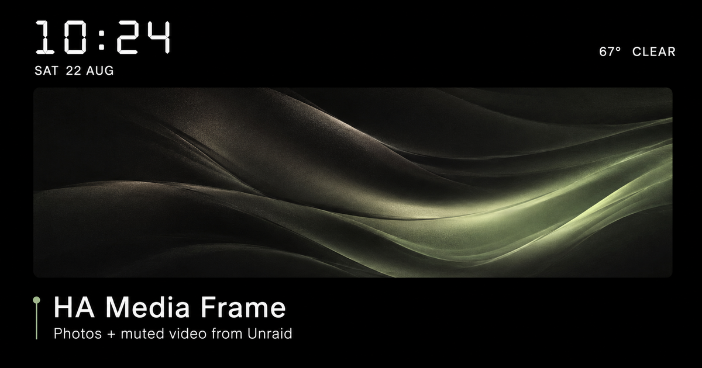

# HA Media Frame Add-on Repository

Home Assistant add-on repository for **HA Media Frame**, a full-screen photo and muted-video display for wall-mounted tablets and Fully Kiosk Browser.



## Add this repository to Home Assistant

[](https://my.home-assistant.io/redirect/supervisor_add_addon_repository/?repository_url=https%3A%2F%2Fgithub.com%2Fjpark40%2Fha-media-frame-addon)

Or add it manually:

1. In Home Assistant, open **Settings → Apps → Install app**.
2. Open the menu in the upper-right and choose **Repositories**.
3. Add this URL:

   ```text
   https://github.com/jpark40/ha-media-frame-addon
   ```

4. Close the repository dialog and refresh the app store.
5. Select **HA Media Frame**, choose **Install**, and then start it.

The first installation builds the container locally on Home Assistant and can take several minutes.

If the local `/addons/ha_media_frame` copy is already installed, stop it before starting the repository version because both use port `8099`. Settings stored by the local installation do not automatically transfer to the repository installation.

## Features

- Recursively displays images and compatible videos from Home Assistant media storage.
- Supports complete-image `contain` mode and full-screen `cover` mode.
- Preloads the next item and repeats each muted video three times by default.
- Shows an optional clock, date, current weather, and four-day forecast.
- Generates ready-to-copy Fully Kiosk Screensaver Playlist JSON.
- Persists settings across add-on upgrades.

See the [HA Media Frame documentation](ha_media_frame/README.md) for setup and usage details.
